# YourLocalCupboard Design Documentation

## Team Information
* Team name: 5E (YourLocalCupboard)
* Team members
  * Nathan Romine
  * Nick Scioli
  * Giovanni Gakau
  * Yujin Lee
  * James Durante

## Executive Summary

Your Local Cupboard application is a web-based platform that connects donors with a food bank's needs. Food bank managers can create, update, and manage a cupboard of needed items, each with a name, cost, quantity, and type. Donors can browse the cupboard, search for specific needs, and pledge to fulfill items. The system stores all of this using persistant JSON files.

### Purpose
The project provides a coordinated donation workflow between two primary user groups: food bank managers and helpers (donors). Managers publish and maintain current needs, while helpers discover those needs and pledge contributions so fulfillment is visible, trackable, and auditable.

### Glossary and Acronyms

| Term / Acronym | Definition |
|------------|--------------------------------------|
| MVP | Minimum Viable Product: smallest releasable scope that still delivers end-to-end value. |
| SPA | Single Page Application: frontend rendering pattern used by Angular in this project. |
| API | Application Programming Interface; REST endpoints exposed by backend controllers. |
| DAO | Data Access Object; persistence abstraction used by service and controller layers. |
| CRUD | Create, Read, Update, Delete operations over domain entities. |
| Need | A requested item or resource from a food bank (name, cost, quantity, type, fulfillment state). |
| Archived Need | Soft-deleted need; hidden from active list but recoverable from archive. |
| Pledge | A helper's contribution (quantity and/or money) toward a need. |
| Pledge Basket | Per-helper staging area for pledges before checkout. |
| Checkout | Operation that applies pledged values to target needs and clears basket entries. |
| Helper | Donor-role user account that can browse needs and pledge contributions. |
| Manager | Food-bank-role account that creates/updates/archives/restores needs. |
| Admin | Admin account that has control over the needs of any food bank. Used for moderation. |

## Requirements

This section describes the features of the application.

### Definition of MVP

The minimum viable product is the barebones system. This includes the functionality to create an account, log in/out, manage pledges as a helper, and manage needs as a manager while having the system automatically track the changes and keep the data persistant.

### MVP Features

- Account Features
  - User login/out
  - User registration
- Helper Features
  - View/search a list of needs
  - Add needs to basket with specific donation amounts
  - Review basket/checkout
- Manager Features
  - Create new needs
  - Edit/archive needs
  - Restore/delete archived needs

### Enhancements

Our group implemented some enhancement features on top of the MVP. We implemented
a map system, which allowed the food bank managers to include their location so the users
could know how they could donate locally.

We also integrated AI into the project by allowing managers to generate a need's description
and icon with AI.

## Application Domain

This section describes the application domain.

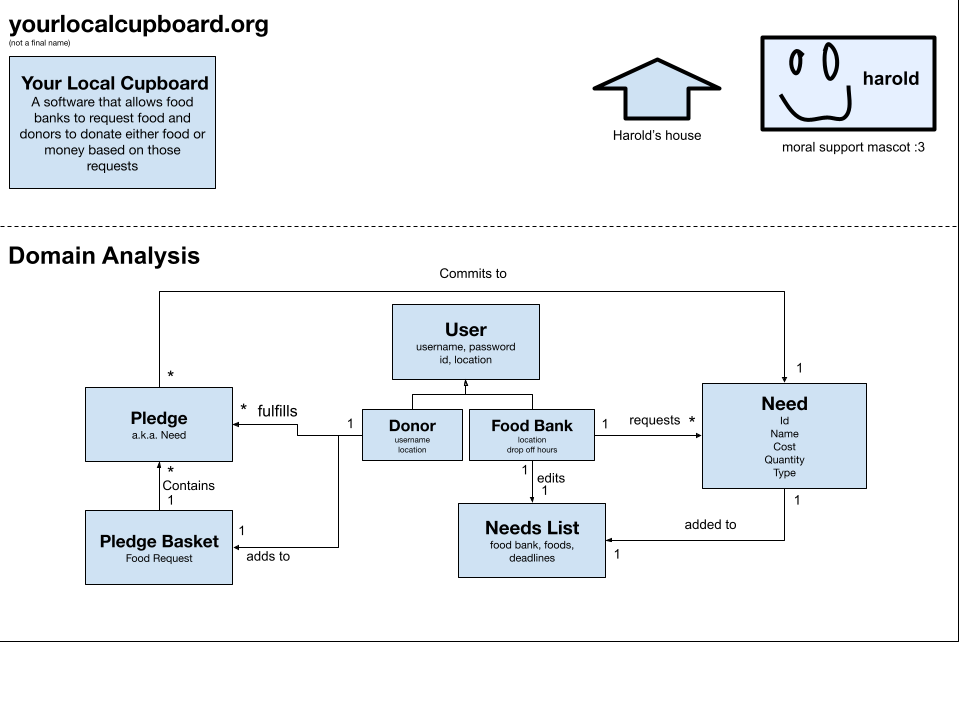

The application domain models food-bank demand and helper contributions:

- A `User` has an account type (`Manager` or `User`/helper) and identity data.
- A `Manager` curates many `Need` entities for their food bank.
- A `Need` describes requested resources (name, type, quantity, cost) and fulfillment progress.
- A `Need` can be active or archived. Archived needs are excluded from active browsing but retained for restore/permanent delete workflows.
- A `Helper` creates `Pledge` entries associated to a target `Need`.
- A helper’s pledges are grouped in a `PledgeBasket` before checkout.
- Checkout applies basket pledges to active needs and then clears the basket.

This model supports operational transparency (what is needed, what is pledged, what is archived), while preserving recoverability and auditability through soft-delete state.

## Architecture and Design

This section describes the application architecture.

### Summary

The following Tiers/Layers diagram shows a high-level view of the webapp's architecture. 
**NOTE**: detailed diagrams are required in later sections of this document.

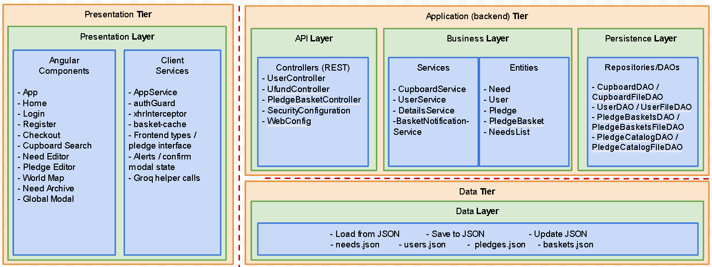

The web application is built using the **Presentation**(frontend), **Application**(backend), **Data** tiered architecture. 

The Presentation (frontend) is a client‑side SPA built with Angular, using HTML, CSS, and TypeScript to deliver the user interface and handle all user interactions.

The Application (backend) tier exposes RESTful APIs, implements business logic, and uses repositories/DAOs to interact with the underlying Data tier for persistence.

The Data contains the mechanisms responsible for storing, retrieving, and managing the application’s data using low‑level storage systems.

Both the Application and Data tiers are implemented using Java and the Spring Framework, with details of their internal components provided below.

### Overview of User Interface

This section describes the web interface and flow; this is how the user views and interacts with the web application.

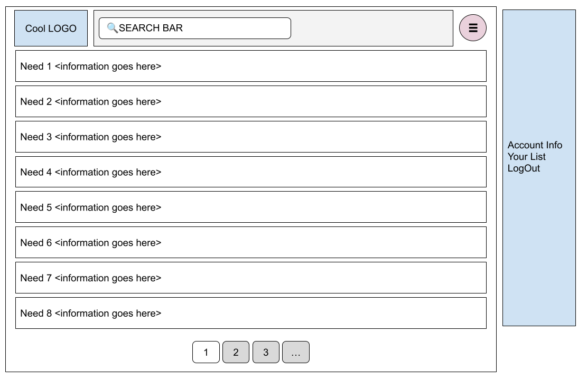

### UI Navigation and Flow
> _Provide a summary of the application's user interface.  Describe, from the user's perspective, the flow of the pages/navigation in the web application.
>  (Add low-fidelity mockups prior to initiating your **[Sprint 2]**  work so you have a good idea of the user interactions.) Eventually replace with representative screenshots of your high-fidelity results as these become available and finally include future recommendations improvement recommendations for your **[Sprint 4]** )_
The user logins in at the login page first,
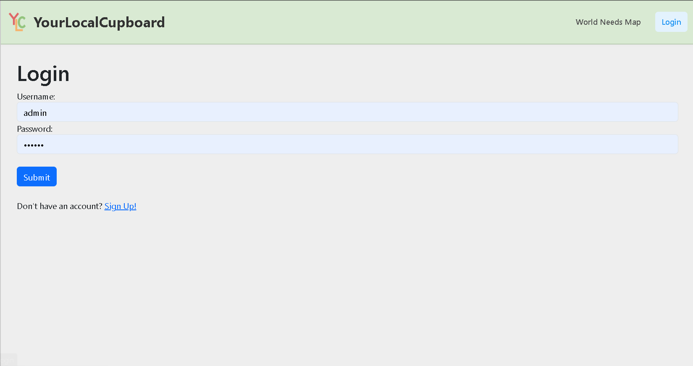
or registers a new account.
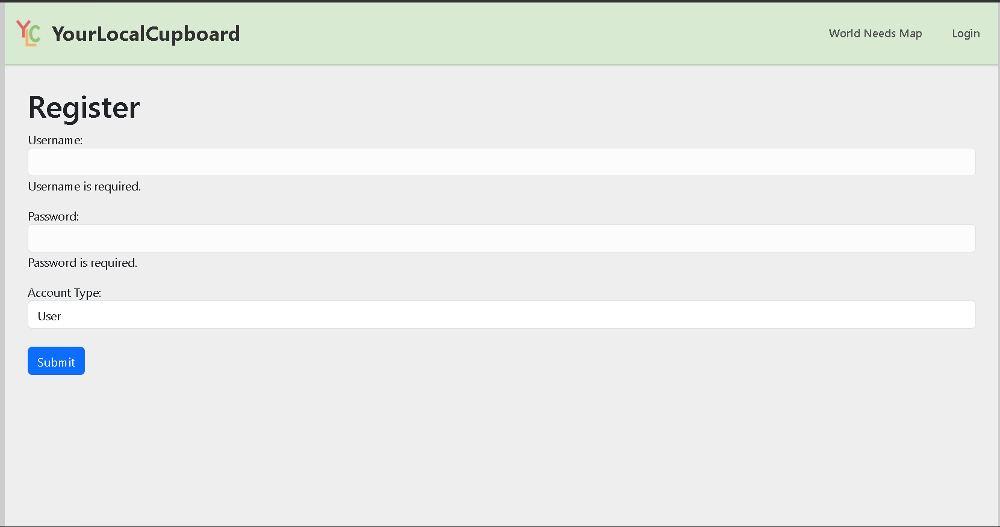
They then see a list of needs, and can search for ones they want.
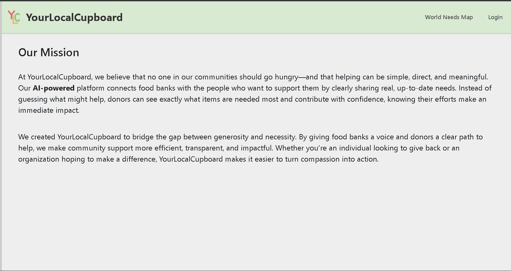
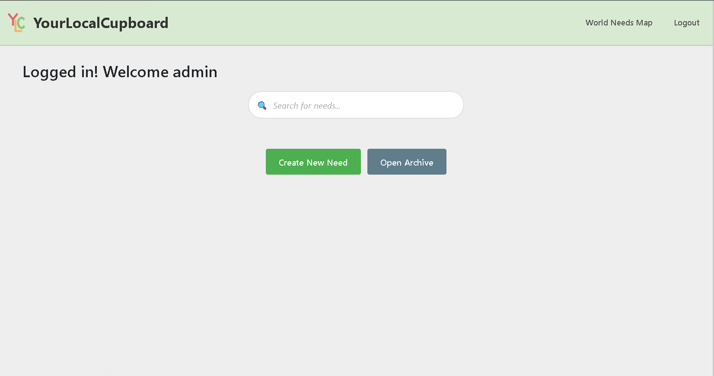
Picking a need to pledge to, the user picks how much to contribute.
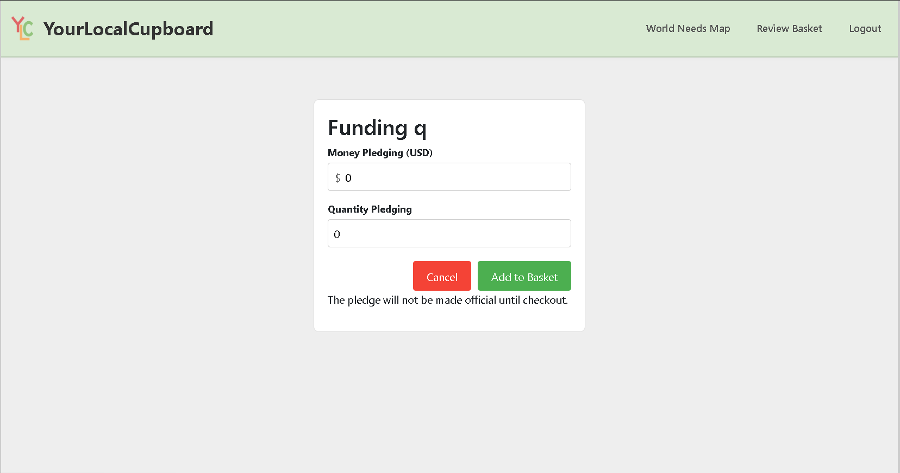
After pledging, the user can click the review basket button, and review their pledges before checking out.
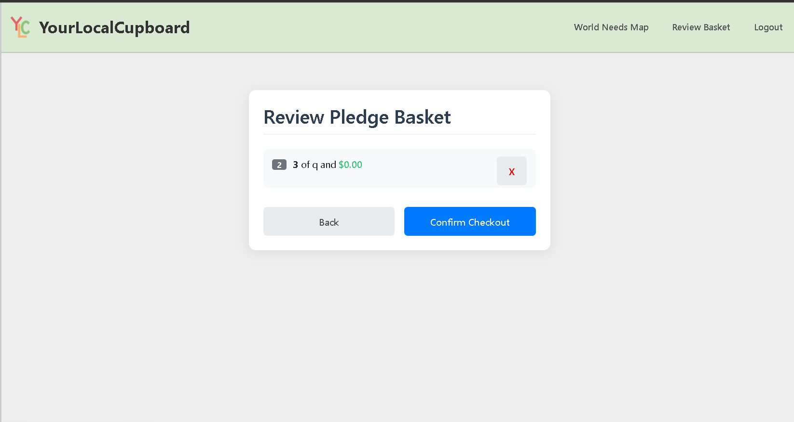
Once they check out, the user is returned to the homepage, and can see their pledges have been funded.
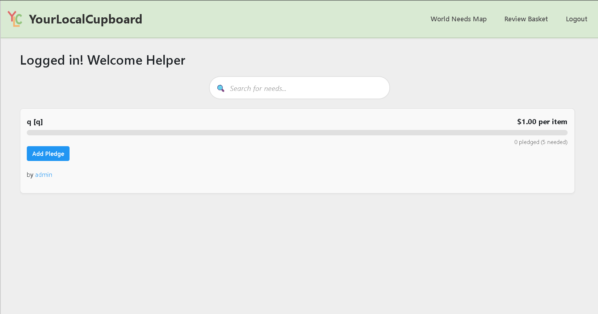
The user can then logout whenever done with their session by clicking the logout button and is returned to the login page.
Managers also have access to archive management from the cupboard view, where archived needs can be restored or permanently deleted.

### Presentation Tier

The Presentation Tier is a client-side Single Page Application (SPA) built with Angular. It is organized into routed feature components, a shared service layer, and a cross-cutting modal component. All HTTP communication to the backend is channeled through a single `AppService`, which keeps individual components decoupled from transport details.

**Angular Components** form the visual and interactive layer. The `App` root component owns the top navigation bar, handles logout, and opens the basket view. From there, the Angular router (`AppRoutingModule`) directs users to one of eight feature pages:

- `Home` – landing page; contains `CupboardSearch`, which polls the backend every three seconds and renders the current list of active needs with search and creator-filter controls.
- `Login` – collects credentials and calls `AppService.logIn()`, then redirects to home on success.
- `Register` – collects username, password, account type, and (for Manager accounts) a Leaflet map location pick, then calls `AppService.register()` followed immediately by an automatic login.
- `NeedEditor` – used by managers to create or update a need; can optionally call the Groq LLM via `AppService.getPrompt()` / `getEmoji()` to AI-generate a description and icon.
- `PledgeEditor` – used by helpers to set quantity and monetary contribution for a need already selected in `CupboardSearch`; submits via `AppService.addPledge()`.
- `Checkout` – shows the helper's current basket (seeded from `basket-cache`), computes surplus warnings, and triggers `AppService.checkout()` for final submission.
- `WorldMap` – renders a Leaflet map showing the geo-locations of all registered managers, populated from `AppService.getWorldMap()`.
- `NeedArchive` – manager-only page that lists soft-deleted needs and allows restore or permanent deletion; guarded by a route check in `ngOnInit`.

**Client Services** provide shared infrastructure:

- `AppService` – the single point of contact with the backend REST API. It wraps all HTTP calls (`HttpClient`), maintains session state (`loggedIn`, `isManager`, `currentlyEditingNeed`), and exposes RxJS `Subject` streams for alert and confirm dialogs consumed by `GlobalModal`.
- `authGuard` – a functional route guard that prevents unauthenticated access to the `/login` route (redirects to home if already logged in).
- `xhrInterceptor` – an Angular `HttpInterceptor` that appends the `X-Requested-With: XMLHttpRequest` header to every outgoing request so the Spring Security back end can distinguish AJAX calls.
- `basket-cache` (`Cache`) – a static in-memory store for the current user's basket pledges and user identity; shared between `App`, `Checkout`, and `PledgeEditor` without a server round-trip.
- `GlobalModal` – a standalone component that subscribes to `AppService.alertMessage$` and `AppService.confirmMessage$` to display non-blocking alert and confirmation dialogs across the entire application.

**Data flow through the tier** follows a consistent pattern: a user action in a component calls a method on `AppService`, which fires an HTTP request through Angular's `HttpClient` (intercepted by `xhrInterceptor`). The response Observable is subscribed to in the component, which updates local state or navigates on success, and calls `AppService.displayAlert()` on error.

#### Sequence Diagram 1 – Helper Adds a Need to Pledge Basket

This diagram illustrates the full round-trip from a helper clicking "Add to Basket" in `CupboardSearch`, through the `PledgeEditor` form submission, to the backend `PledgeBasketController`, and down to the two JSON persistence files.

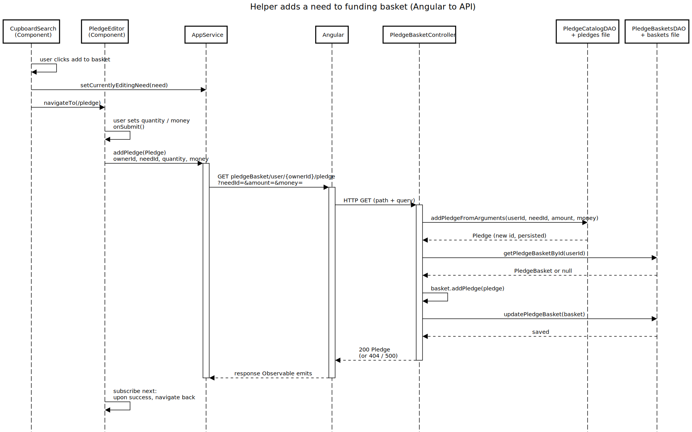

#### Sequence Diagram 2 – Archive and restore Need

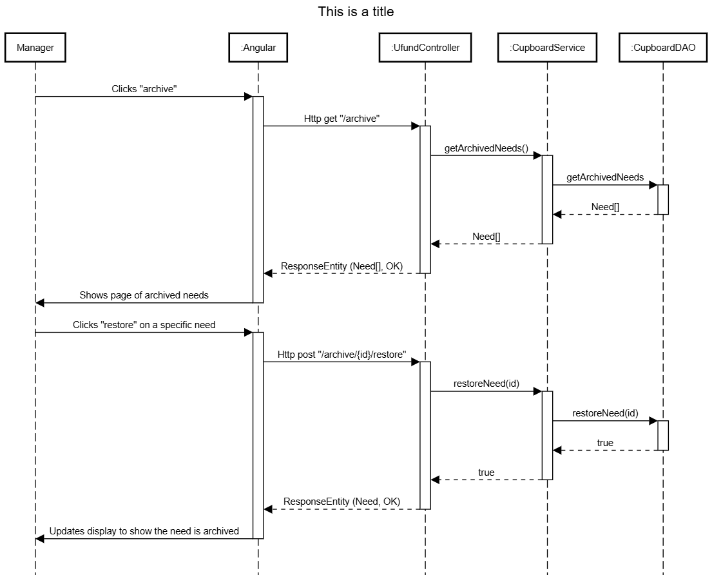

### Application Tier
The Application Tier contains the core logic needed for the application itself to work. It contains the API layer, which handles requests for data, the business layer, which contains the logic to work with the objects in our app (Need, User, etc.), and the persistence layer, which contains DAOs that can interact with the data related to our objects.
#### API Layer
The API layer handles web requests and issues relevant data in response.
- **UfundController** – Intercepts requests at mapped endpoints, performs CRUD operations on `needs.json`, and issues responses with relevant data.  
- **Need** – Defines a need object.  
- **CupboardDAO** – Interface for need object management and persistence.  
- **CupboardFileDAO** – Implementation of the `CupboardDAO` interface; reads from the `needs.json` file and mediates communication between the data layer and API controller.
- **PledgeBasketController** – REST API for donor pledge-basket operations under the `/pledgeBasket/...` path (view basket pledges, add/update/remove pledges, and checkout).  
- **Pledge** – Represents an individual pledge (pledge id, ownerId, needId, quantity, money) persisted in the pledge catalog.  
- **PledgeBasket** – Per-owner container of pledges (ownerId + pledgeIds) that supports adding/updating/removing pledged items and checkout behavior.  
- **PledgeBasketsDAO** – DAO interface for retrieving/persisting pledge baskets by id/owner and for performing checkout/distribution.  
- **PledgeCatalogDAO** – DAO interface for creating/managing `Pledge` entities (id generation, add/update/remove, and lookup by id).  
- **PledgeBasketsFileDAO** – JSON-file implementation of `PledgeBasketsDAO`. stores baskets as ownerId + pledgeIds and resolves pledges via `PledgeCatalogDAO`.  
- **PledgeCatalogFileDAO** – JSON-file implementation of `PledgeCatalogDAO`. maintains an in-memory pledge map, assigns `nextId`, and serializes updates to the configured `pledges.file`.
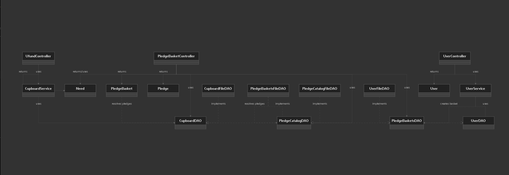
#### Business Layer
> _**[Sprint 1, 4]** Provide a summary of this architectural layer._
- Spring 1 - We provide the management of the cupboard regarding the need. the user can Create, add, delete, search for, and update a need inside their cupboard.
> _**[Sprint 1, 2, 3]** List the classes supporting this layer and provide a brief description of their purpose._
- **CupboardService** – Business/service layer that mediates between controllers and the `CupboardDAO`, enforcing the application’s cupboard use cases (get/search/create/update/delete needs).  
- **UserService** – Business/service layer for account operations; creates users via `UserDAO` and initializes a donor’s `PledgeBasket` via `PledgeBasketsDAO` during account creation.  
- **DetailsService** – Spring Security `UserDetailsService` implementation that loads user credentials from `UserDAO` for authentication.  
- **Need** – Core domain entity for cupboard needs (id, name, cost, quantity, type) used by business logic and returned through the API.
> _At appropriate places as part of this narrative provide **one** or more updated and **properly labeled**
> static models (UML class diagrams) with some details such as associations (connections) between classes, and critical attributes and methods. (**Be sure** to revisit the Static **UML Review Sheet** to ensure your class diagrams are using correct format and syntax.)_
> 

#### Persistence Layer
The persistence layer handles all storage and retrieval of Need objects by defining a clear DAO interface and a JSON‑backed implementation. CupboardDAO specifies the operations for accessing and modifying Need data, while CupboardFileDAO provides the concrete behavior by maintaining an in‑memory map of Needs, assigning unique IDs, preventing duplicates, and using Jackson to serialize and deserialize the data to a JSON file defined in application.properties. All changes, creates, updates, and deletes are synchronized for thread safety and written back to the file, ensuring consistent and reliable persistence across the application.
>
- **CupboardDAO** – Persistence interface for cupboard `Need` storage.  
- **CupboardFileDAO** – JSON-file implementation of `CupboardDAO`. keeps a map of needs, assigns unique IDs, prevents duplicate names, and persists changes to the configured `needs.file`.  
- **UserDAO** – Persistence interface for user account storage.  
- **UserFileDAO** – JSON-file implementation of `UserDAO`. maintains an in-memory map of users, enforces unique usernames, assigns unique IDs, and persists changes to the configured `users.file`.  
- **PledgeCatalogDAO** – Persistence interface for `Pledge` entities.  
- **PledgeCatalogFileDAO** – JSON-file implementation of `PledgeCatalogDAO`. stores pledges in-memory, assigns `nextId`, and persists to the configured `pledges.file`.  
- **PledgeBasketsDAO** – Persistence interface for `PledgeBasket` objects.  
- **PledgeBasketsFileDAO** – JSON-file implementation of `PledgeBasketsDAO`. stores baskets as ownerId + pledgeIds, persists to the configured `baskets.file`, and resolves pledge entities via `PledgeCatalogDAO`.  
- **Need / Pledge / PledgeBasket / User** – Model classes that are serialized/deserialized by Jackson for file-backed persistence.

> _At appropriate places as part of this narrative provide **one** or more updated and **properly labeled**
> static models (UML class diagrams) with some details such as associations (connections) between classes, and critical attributes and methods. (**Be sure** to revisit the Static **UML Review Sheet** to ensure your class diagrams are using correct format and syntax.)_
> 
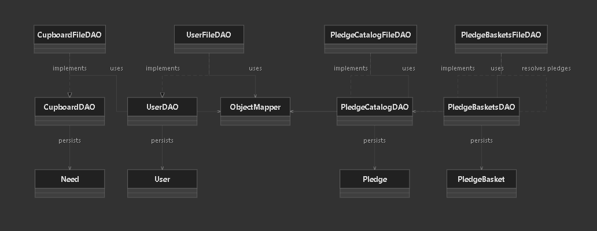

### Data Tier

Our data tier functions by storing needs, pledge baskets, pledges, and users in respective JSON files as JSON objects. We use the FileDAO classes (which implement the DAO classes) to pull data from these files to use within the app, supporting standard CRUD (create, update, read, delete) and specialized functions relating to the type of data (searching for multiple needs, users, etc.).

Classes involved:
- **CupboardDAO** - An interface that has all of the public methods used to interact with the data
- **CupboardFileDAO** - Implements CupboardDAO, and is in control of the json file
- **PledgeBasketsDAO** - An interface for interacting with stored pledge basket data
- **PledgeBasketsFileDAO** - Implements PledgeBasketsDAO to access the JSON file that holds pledge baskets
- **PledgeCatalogDAO** - Interface for interacting with the list of pledges
- **PledgeCatalogFileDAO** - Implements PledgeCatalogDAO to access the JSON file that holds the catalog of pledges
- **UserDAO** - Interface for interacting with the list of users
- **UserFileDAO** - Implementation of UserDAO to access JSON file with user data

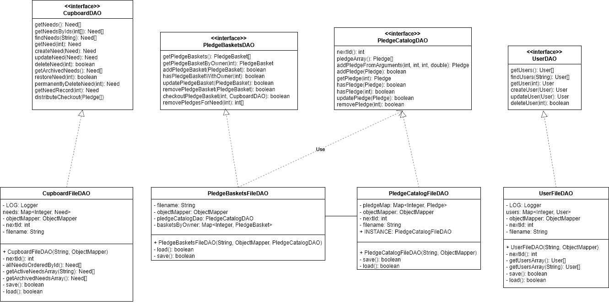

## OO Design Principles

1) **Low Coupling**
   - **Principle:** Components should depend on abstractions/interfaces, not concrete implementations, to reduce ripple effects from change.
   - **Project Example:** Controllers and services depend on DAO interfaces (`CupboardDAO`, `PledgeBasketsDAO`, `UserDAO`) with file-based implementations injected by Spring.
   - **Where this materializes across tiers:**
     - **Presentation Tier:** Angular components call `AppService` methods instead of constructing HTTP requests everywhere, so UI components are decoupled from transport details.
     - **Application Tier:** Controllers depend on services (`CupboardService`, `UserService`) and DAO interfaces rather than concrete file classes.
     - **Data Tier:** DAO interfaces (`CupboardDAO`, `PledgeCatalogDAO`, `PledgeBasketsDAO`) allow persistence implementations to evolve without changing controller/service contracts.

2) **Controller (GRASP)**
   - **Principle:** Assign responsibility for handling a system event to a non-UI object representing the use-case boundary.
   - **Project Example:** `UfundController`, `PledgeBasketController`, and `UserController` are request-entry controllers that delegate to services/DAOs.
   - **Where this materializes across tiers:**
     - **Presentation Tier:** UI emits events such as search, archive, restore, and checkout via routed pages/components.
     - **Application Tier:** Controllers translate those events into HTTP use-cases (`/cupboard/archive/{id}/restore`, `/pledgeBasket/user/{id}/checkout/`).
     - **Data Tier:** The controller-triggered workflows are completed by DAO operations (`restoreNeed`, `permanentlyDeleteNeed`, `checkoutPledgeBasket`) that persist state changes.

3) **Separation of Concerns**
   - **Principle:** Distinct responsibilities are isolated by layer to keep logic maintainable and testable.
   - **Project Example:** Presentation (Angular), API (controllers), business (services), and persistence (DAOs/file stores) are intentionally separated.
   - **Where this materializes across tiers:**
     - **Presentation Tier:** Pages/components focus on rendering and user interaction.
     - **Application Tier:** Services contain workflow logic (archive side effects, basket notification flow), while controllers focus on request/response handling.
     - **Data Tier:** File DAO classes focus only on persistence concerns (load/save, ID mapping, filtering active vs archived records).

4) **Encapsulation**
   - **Principle:** Internal object state is protected; behavior is exposed through controlled methods.
   - **Project Example:** Domain models (`Need`, `PledgeBasket`, etc.) keep fields private and update state via methods like `markDeleted`, `clearDeleted`, `removePledge`, and `checkout`.
   - **Where this materializes across tiers:**
     - **Presentation Tier:** UI uses exposed DTO/model properties and API responses; it does not mutate backend private state directly.
     - **Application Tier:** Service/controller logic changes entities through behavior methods, not direct field mutation of persistence internals.
     - **Data Tier:** DAO classes encapsulate internal maps and synchronization (`synchronized` access patterns), exposing only interface methods for safe state transitions.

Supporting diagrams for these claims are shown in:
- Tiers & Layers diagram: `architecture-tiers-and-layers.png`
- API layer class diagram: `api-layer.png`
- Business layer class diagram: `business-layer.png`
- Persistence layer class diagram: `persistence-layer.png`
- Data tier UML: `data-tier-UML.png`

> _**[Sprint 3 & 4]** OO Design Principles should span across **all tiers.**_

## Static Code Analysis/Future Design Improvements

We use SonarQube for our static code analysis.

> In the need class, SonarQube showed this issue:
> 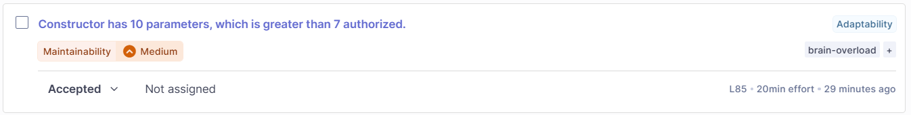
> This is the bigger of two constructors for the need class. This constructor needs to be this large in order to inject all dependancies and set all values for unit testing purposes, so this constructor should remain the same. We have a simpler constructor too that makes the code more usable and easier to read.

> In the unit tests for the pledge basket, SonarQube showed these issues:
>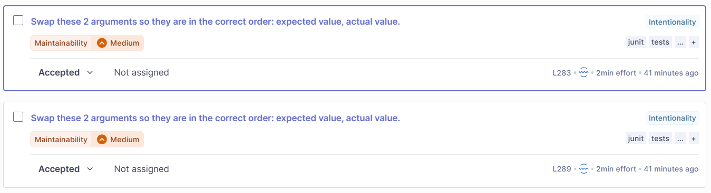
> This issue is very simple, and all that needs to be done is to swap the values we're passing for the assertNotEquals parameters. The code currently works as is since equals (and not equals) is communative, but it's bad practice and should be fixed.

> In the unit tests for the pledge catalog file DAO, SonarQube showed this issue:
>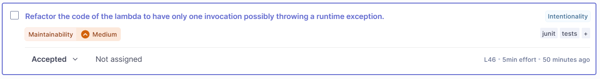
> This issue stems from the fact that two different parts of the code in the parameter of the assertThrows statement can throw the exception that is being tested for. This means that the test can pass if constructing the Need throws the error instead of the addPledge method, and we were testing for the addPledge to throw the error. This should be fixed by constructing the Need on a previous line, then using that pre-created need, so that we are only testing for the desired exception.

In the future, our group could improve the structure of our code by removing and fixing redundant and "spaghetti" code. This includes the mostly redundant NeedsList class (that could be swapped out with an array of needs) and the weird instance variable in the pledgeCatalogFileDAO. This would go along with the introduction of more services as well as fixing some get request that should be post/put requests, and other things to make the code follow better practices.

## Testing
> _This section will provide information about the testing performed
> and the results of the testing._

### Acceptance Testing

All Acceptance tests pass

NO TESTING - 2
- pledgeBasketUpdate
- checkOut

### Unit Testing and Code Coverage

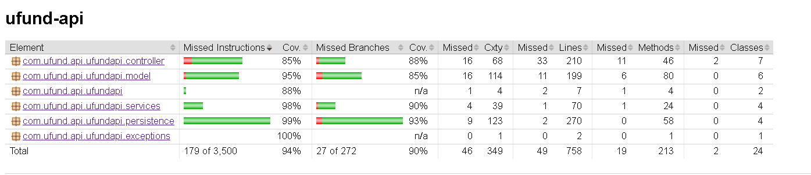
Our unit testing strategy focuses on tiered coverage:
- **Model-tier tests** validate entity behavior and edge cases (`NeedTests`, `PledgeBasketTest`).
- **Controller-tier tests** verify endpoint response codes and branching behavior (`UfundControllerTest`, `PledgeBasketControllerTest`, `UserControllerTest`).
- **Persistence-tier tests** validate DAO behavior, save/load error handling, and archive workflows (`CupboardFileDAOTest`, `PledgeBasketsFileDAOTest`, etc.).

Coverage is gathered with JaCoCo through Maven test runs. Team target is to keep core model/service/controller classes at high branch coverage, with particular focus on archive and checkout logic (high-risk workflow paths). Current status is that archive-related and pledge-basket paths now have dedicated positive and negative-path tests.

To generate/preview coverage locally:
- `mvn test`
- `mvn jacoco:report`

Coverage report output location:
- `target/site/jacoco/index.html`

Coverage images should be exported from that report and embedded in this section before final submission.
## Ongoing Rationale

(2026/2/14): Sprint 1
Description: We decided we may not need the NeedsList.java.

(2026/3/28): Sprint 2
Description: Introduced soft-delete archive lifecycle for `Need` (`is_deleted`, `time_deleted`) to avoid irreversible accidental data loss and support manager restore workflows.

(2026/3/29): Sprint 2
Description: Added archive-specific endpoints (`/cupboard/archive`, restore, permanent delete) rather than overloading the active-list endpoints, improving API clarity and reducing accidental client misuse.

(2026/4/01): Sprint 2
Description: Added basket purge + notification flow when a need is archived so helper pledge baskets remain valid and users receive contextual messaging.

(2026/4/07): Sprint 2
Description: Added UI polling on cupboard/archive pages (3s interval) for near-real-time multi-user synchronization without requiring WebSocket infrastructure in this sprint.
